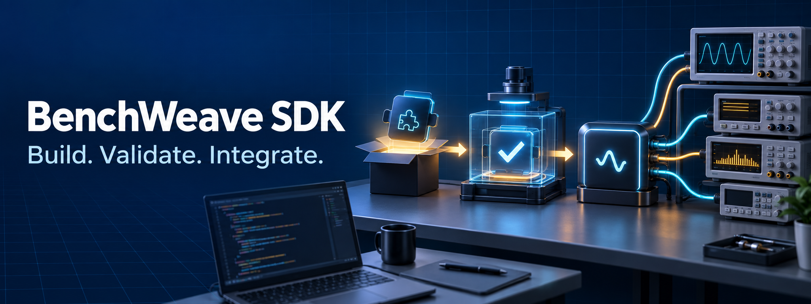

# BenchWeave plugin developer SDK

Build an external device plugin. The plugin does not need gateway internals. Python 3.13+, SDK 0.6.0, OTDP 0.2.2 and adapter API 1.1 are the baseline. This package is a separate wheel built alongside BenchWeave. PyPI publishes it as benchweave-sdk.

## Installation

Stable releases are on PyPI:

```sh
# plugin authoring: `new` renders the copier template (issue #347 WS2)
pip install 'benchweave-sdk[scaffold]'
# scaffold-free install (check/conformance/preview only)
pip install benchweave-sdk
# or as an isolated CLI tool
uv tool install benchweave-sdk
# or via Homebrew (macOS and Linux)
brew install madeinoz67/tap/benchweave-sdk
```

For the newest unreleased code, install from the default branch:

```sh
pip install git+https://github.com/madeinoz67/benchweave-sdk.git
```

To do development work on the SDK itself, clone the repository. Then run `uv sync --extra test`.

An installed SDK can check its vendored standards offline with `benchweave-sdk sync-standards --check`. An import of a standards bundle rewrites the source tree, so it needs a repository checkout.

## Five steps

> [!CAUTION]
> A template is not qualified firmware or a real instrument driver.

New here? The [getting-started page](https://madeinoz67.github.io/benchweave-sdk/docs/user-guide/getting-started.html) walks these five steps with the full commands and the expected output.

1. Install the SDK from PyPI with `uv pip install 'benchweave-sdk[scaffold]'` — the `[scaffold]` extra carries the copier dependency `new` renders through; without it, `new` refuses with `scaffold_extra_absent:` naming the install command. For more options, see [Installation](#installation).
2. Run `benchweave-sdk new plugins/acme/model100 --package benchweave_acme_model100`. Replace `acme/model100` with your manufacturer and device name. The independent project contains `src/benchweave_acme_model100/` and `tests/`.
3. Change into the generated project with `cd plugins/acme/model100`. Replace the explicitly synthetic protocol with verified device behaviour. Then update the descriptor of the generated plugin. The generated `AI-GUIDE.md` describes the design, build, test, review and release steps. `CLAUDE.md` at the root carries agent notes and imports `AGENTS.md`, the SDK-managed agent guide; `.claude/skills/` at the root holds the five SDK-managed workflow skills (`benchweave-plugin-workflow`, `benchweave-descriptor`, `benchweave-plugin-ui`, `benchweave-adapter-testing`, `benchweave-capture`) — `benchweave-sdk upgrade` refreshes them, and editing them gives conflict markers, never silent loss. The seeded skills under `src/benchweave_acme_model100/skills/` are different content and ship with the package. The skill `develop-plugin` is for plugin development. The skill `drive-device` is the demo driver to rewrite.
4. Install the plugin with its test dependencies. Run the plugin tests. Run `benchweave-sdk check src/benchweave_acme_model100/descriptor.json`. Record all applicable S01–S18, C01–C12 and M01–M14 obligations and evidence. The basic SDK checks do not cover all of them.
5. Build with `uv build`. Prepare the registry metadata and the reviewed evidence. Approve the release before publication or hardware qualification. `benchweave-sdk inventory` helps generate hashes, not a complete registry manifest.

The generated runtime has no dependency on this SDK. The plugin test extra pins the SDK version from PyPI. Run `benchweave-sdk doctor` from the project to check that the pin matches the installed SDK. The command works offline. Generate a plugin dependency lock for the plugin. Retain it in the plugin repository.

Scaffolded projects carry `.copier-answers.yml` (template provenance). `benchweave-sdk upgrade` moves a committed, clean git project to the installed SDK's released template tag — author-owned files are preserved; a file both sides changed comes back with conflict markers to resolve and commit. Pre-copier projects gain provenance with `benchweave-sdk adopt` (infers the base from the pyproject pin; refuses what it cannot provenance).

## Documentation

### Registry management (eight `registry` commands)

The `benchweave-sdk registry` family manages a clone of the [benchweave-registry](https://github.com/madeinoz67/benchweave-registry) repository offline. The commands work directly with git. Every command takes `--registry-clone`.

Contributors track their own submissions with `registry status`. The command reports the exact submission set. It also reports the lifecycle timeline of each release. The committed records alone supply this data.

Maintainers derive the queue with `registry queue`. The queue has 7 stages. The stages come from the records plus the PR state. A `--pr-state` fixture or a live `gh` supplies the PR state. Maintainers write the signed baseline status document of a release with `registry publish-status`. The origin key is a local PEM file argument. The key never enters a repository or CI. Maintainers also manage the release lifecycle:

- `registry yank` sets the status sequence to the next number and signs the status document again.
- `registry advise` adds an advisory to the served status. The release stays published.
- `registry unlist` appends a record only. The release stays admissible.
- `registry withdraw` works before acceptance only.
- `registry transfer` needs both consents plus the vetting citation of the receiver.

Every record write appends a new file under `records/lifecycle/…`. No command deletes or rewrites history.

The registry uses its own process for its own release. Status documents there are an interim measure. `publish-status` refuses when a baseline already exists, with the prefix `status_present:`. No CLI command signs an EXISTING unsigned baseline. That signature is a maintainer ceremony with the origin-key mint, kept out of band by design. It is not a CLI operation.

The project publishes the versioned documentation site at <https://madeinoz67.github.io/benchweave-sdk/>. Start from the rendered [plugin SDK guide](https://madeinoz67.github.io/benchweave-sdk/docs/user-guide/plugin-sdk.html). The version selector on each docs page switches between the released versions and the current `main` build.

## Which checkout do I use?

**This repository (`madeinoz67/benchweave-sdk`) is the canonical SDK.** Install it, scaffold plugins with it, and develop SDK features here.

The gateway repository (`madeinoz67/benchweave`) also contains `packages/sdk/`. That directory is a git-submodule mount of this repository, used for gateway integration. The mount is **not** the canonical SDK. The mount can lag this repository. If you build a plugin, use this repository, not `packages/sdk/`.

To see which SDK you have:

```sh
grep '^version' pyproject.toml   # the version this checkout declares
git describe --tags              # the nearest release tag on this checkout
benchweave-sdk --version         # the version of an installed SDK
```

The BenchWeave gateway and the canonical architecture and contract standards live in the main repository: [madeinoz67/benchweave](https://github.com/madeinoz67/benchweave). The main repository mounts this SDK at `packages/sdk` as a git submodule. The SDK has its own CI and release cycle.

## Community

Questions and discussion happen on the [BenchWeave Discord](https://discord.gg/Y5XPTWQQXr). The invite is permanent. Put SDK bugs and feature requests in the [gateway issue tracker](https://github.com/madeinoz67/benchweave/issues). The project uses one issue stream. The SDK repository's tracker is retired.

## Directory structure

In a plugin collection, each device plugin is an independent project at `plugins/<manufacturer>/<name>/`. The SDK itself stays in `packages/sdk/`. An external plugin repository can use that device project as its repository root. It does not need the enclosing `plugins/<manufacturer>/` directories. The project directory and the Python import package have different roles. The project directory `acme/model100` organises the collection. The `--package` option selects the import name, for example `benchweave_acme_model100`.

Create a project from the collection root:

```sh
benchweave-sdk new plugins/acme/model100 --package benchweave_acme_model100 --with-ui
cd plugins/acme/model100
```

The destination must not already exist. A destination that you reach through a symlinked directory is canonicalized before any write. On macOS, `/tmp/...` is such a symlink. Messages report the real path. Omit `--with-ui` for a plugin without presentation metadata.

```text
plugins/acme/model100/                 # independent plugin project
├── pyproject.toml                     # build configuration and test dependencies
├── README.md
├── AI-GUIDE.md                        # generated development workflow
├── CLAUDE.md                          # generated agent notes; root dev tooling
├── AGENTS.md                          # SDK-managed agent guide; CLAUDE.md imports it
├── .claude/skills/                    # five SDK-managed workflow skills
├── UI-GUIDE.md                        # generated only with --with-ui
├── docs/                              # author-supplied device documentation
│   ├── compatibility.md               # supported models/firmware and limitations
│   └── qualification.md               # supervised hardware test plan/evidence
├── firmware/                          # optional author-supplied firmware material
│   ├── README.md                      # official sources, versions and checksums
│   └── release-notes/                 # relevant vendor changes and upgrade constraints
├── src/
│   └── benchweave_acme_model100/       # import package; included in the wheel
│       ├── __init__.py
│       ├── adapter.py                 # SDK-facing adapter and create_plugin
│       ├── protocol.py                # device protocol implementation
│       ├── descriptor.json            # OTDP device/operation contract
│       ├── protocol.md                # protocol evidence, initially synthetic
│       ├── vectors.json               # exact exchanges, initially synthetic
│       ├── skills/                    # seeded agent skills; ship in the wheel
│       │   ├── develop-plugin/SKILL.md    # authoring workflow, elicitation, release
│       │   └── drive-device/SKILL.md      # synthetic demo driver; rewrite for the device
│       ├── config/                    # optional configuration for a headless plugin
│       │   ├── settings.schema.json   # author-supplied complete-settings schema
│       │   └── presets/
│       │       └── default.json       # author-supplied configuration preset
│       ├── presentation.json          # --with-ui: envelope and resource root
│       ├── binding-catalogue.json     # --with-ui: descriptor-aligned targets
│       └── ui/                        # --with-ui: presentation resource root
│           ├── manifest.json          # generated readings page; no plot required
│           ├── fixtures/              # generated synthetic preview examples
│           │   ├── normal.json
│           │   └── warning.json
│           ├── settings/              # author-supplied, when configuration exists
│           │   └── settings.schema.json
│           ├── presets/               # author-supplied complete configurations
│           │   └── default.json
│           └── assets/                # author-supplied declared static resources
└── tests/
    ├── test_plugin.py                 # generated mock/conformance tests
    ├── test_presentation_preview.py   # generated offline preview conformance test
    ├── test_configuration.py          # author-supplied schema/preset checks
    ├── test_presentation.py           # author-supplied UI binding/asset checks
    └── fixtures/                      # author-supplied exchanges by model/firmware
```

The SDK generates `ui/manifest.json`, schema-valid synthetic examples under `ui/fixtures/`, and `tests/test_presentation_preview.py`. The `docs/`, `firmware/`, `config/`, optional UI asset directories and additional test files remain author-supplied extensions. Add only the features the device plugin supports. `default.json` is an example filename. The SDK does not select or apply it automatically.

| Optional feature | Recommended location | Behaviour and ownership |
| --- | --- | --- |
| Device configuration without UI | `src/<package>/config/settings.schema.json` and `config/presets/` | Validate complete settings offline with `check-preset`. The application of settings needs an approved device procedure. |
| Device configuration shown in UI | `src/<package>/ui/settings/` and `ui/presets/` | Keep one authoritative copy inside the UI resource root. Declare it in the manifest. Do not duplicate it under `config/`. |
| Specialised pages and optional graphs | `src/<package>/ui/manifest.json` and `ui/assets/` | Declare bindings, plot metadata and supported panel IDs. A page need not have a graph. Browser rendering remains separate work. |
| Data collection | Descriptor action and measurement contracts, adapter code and `tests/fixtures/` | Declare supported acquisition and dataset bindings. The gateway owns execution and retained data. Plugins do not package live datasets here. |
| Firmware compatibility | `docs/compatibility.md`, descriptor firmware constraints and firmware-specific test fixtures | State the supported firmware versions. Retain the evidence. The descriptor remains the runtime compatibility contract. |
| Firmware reference material | `firmware/README.md` and `firmware/release-notes/` | Record vendor sources, exact version and checksum information, and upgrade constraints. The SDK does not discover content in this directory. The SDK also does not flash firmware from it. Do not redistribute vendor images by default. If a release explicitly requires an image and the licence permits it, redistribute only that image. |
| Hardware qualification | `docs/qualification.md` | Record the supervised test plan, tested versions and evidence. Synthetic tests do not establish hardware qualification. |

A preset contains complete settings and metadata about compatibility and provenance. A preset does not contain collected measurements. A plugin can have configuration without a UI, or a UI without configuration. A plugin can also declare firmware compatibility and ship no firmware images.

Keep distributable resources inside `src/<package>/` so that the generated Hatch wheel configuration includes them. Generate `uv.lock` for the development dependencies. Retain it in the project. Supply the correct licence and release evidence before distribution. The scaffold does not supply these. Build outputs belong in `dist/`. Gateway configuration, credentials, live readings and retained datasets belong to the deployment and runtime stores. These stores are outside the plugin source package.

### Path resolution and validation

Run these commands from the plugin project root after you install its development dependencies:

```sh
benchweave-sdk check src/benchweave_acme_model100/descriptor.json
benchweave-sdk check-ui src/benchweave_acme_model100/presentation.json \
  --descriptor src/benchweave_acme_model100/descriptor.json \
  --resources src/benchweave_acme_model100 \
  --catalogue src/benchweave_acme_model100/binding-catalogue.json \
  --firmware 1.0.0
pytest
uv build
```

Here `--resources` points to the **package root**. The generated envelope's `resource_root: "ui"` selects its `ui/` subdirectory. Manifest asset paths such as `settings/settings.schema.json` and `presets/default.json` are relative to that UI root.

Resource paths must stay inside the root. Resource paths must not traverse symlinks. Use canonical local paths. On macOS, use `/private/tmp/...` and not the `/tmp` symlink for temporary preview projects.

After you edit resources, keep the descriptor, manifest and asset byte hashes current. Align the binding catalogue with the descriptor. The host verifies the catalogue during admission. A packaged candidate catalogue does not grant device capabilities.

## Optional plugin pages and presets

Add `--with-ui` to `benchweave-sdk new` to generate a declarative readings page, presentation envelope and binding catalogue. The default scaffold stays unchanged. Keep presentation assets under the import package's `ui/` directory so that wheels carry them. Store complete configuration presets next to their settings schema. Plugins can declare configuration, readings, dataset and registered panel pages, with plots only when appropriate.

Use `benchweave-sdk check-ui` and `benchweave-sdk check-preset` for offline validation before packaging. Validation does not admit a plugin. Validation is not approval to apply settings. The [plugin presentation guide](https://github.com/madeinoz67/benchweave/blob/main/standards/plugin-ui/0.3.0/README.md) (main repository) covers the directory structure, preconfigured settings, optional graphs, data bindings, per-channel display hints and CLI examples.

### Local UI preview

The SDK includes the version-matched React renderer and nine deterministic baseline scenarios.

> [!CAUTION]
> Preview success is not admission, not hardware qualification and not permission to operate equipment.

Preview author fixtures with this command. The preview does not import plugin Python. The preview does not open a device transport. The preview does not contact a gateway:

```sh
benchweave-sdk preview-ui src/benchweave_acme_model100/presentation.json \
  --descriptor src/benchweave_acme_model100/descriptor.json \
  --resources src/benchweave_acme_model100 \
  --catalogue src/benchweave_acme_model100/binding-catalogue.json \
  --fixtures src/benchweave_acme_model100/ui/fixtures
```

Use `--no-open` in CI or for a terminal-only readiness check. The default listener is an ephemeral port on `127.0.0.1`. The command rejects wildcard listeners. A non-loopback host needs `--allow-network`. A non-loopback host remains unsuitable for shared or production use. UI contributors can point at a compatible Vite renderer with `--renderer-url`. The CLI adds the preview server URL as the renderer's `apiBase` query parameter. The CLI permits cross-origin API responses only for that renderer's exact origin. Both renderers need preview API version 1.

The command suite uses Click for stable parsing and stable exit codes. It uses Rich for readable non-interactive output. In an interactive terminal, `preview-ui` uses a Textual status screen. Press `o` to open the browser again. Press `q` to stop the preview. The commands deliberately bypass Textual for `--no-open` and non-terminal output. Thus CI, pipes and SDK tests stay deterministic.

Every preview carries the label `SIMULATED PRESENTATION DATA`. A control interaction creates only an in-memory simulated receipt. It never updates an observed reading optimistically.

## The server extra

Install the optional server extra to serve one plugin project without a gateway:

```sh
pip install 'benchweave-sdk[server]'
```

The extra installs FastAPI, FastMCP, Jinja2, Uvicorn, the published `benchweave-ui-html` package and pyserial. The page design tokens come from that package. The package is held at an exact version. A design change reaches this host through a new package release and a pin update in this repository. The extra adds the command `benchweave-sdk-server`. One process serves a server-rendered HTMX UI, a JSON REST API and an MCP endpoint over one operations seam. `benchweave-sdk-server mcp <project>` runs the same MCP server over stdio, with no HTTP listener.

```sh
benchweave-sdk-server serve /path/to/plugin-project --transport mock --port 8477 --no-open
```

The default transport is the scripted mock transport. It replays the exact exchanges that the plugin's `vectors.json` declares. With `--transport serial --device <path>`, the host serves a real serial port with the descriptor's own declared settings. pyserial rides the server extra only; a default install never gains it. Discovery opens candidate ports and asks each for its identity, filtered by the descriptor's declared USB hint (`x-standalone-usb-vid`/`x-standalone-usb-pid` extension keys under `transport.settings`) where declared. An unparseable declared hint refuses the scan and names the value. Loading the page never transmits: the page serves the last scan's result, and scanning is an explicit button. A refused scan renders its refusal. A transport fault keeps the device refused until a reconnect mints a fresh link.

The `SerialCaptureServices` transport class takes an optional `capture_max_bytes` value. This value is the writer's byte reservation for one capture. The class flushes to the writer at the block size or the reservation, whichever is smaller. The writer refuses an append that crosses the reservation at each append. A refused capture stays abortable. The abort removes the event directory, so you can reuse the capture id in the same process. A capture left behind by a crash keeps its id reserved. Remove the capture root to clear it. The orphan sweep is a later slice.

A plugin with presentation documents renders its declared pages at `/pages/<page-id>`. Each readings page shows one reading tile per observation binding. Each tile shows the value, the unit and the device's own quality string. The page severity is composed from the readings. Plots render from the declared manifest. The plot data comes from the host's own bounded observation of the reads. The host decimates the data before it serves the page. The page shows how many samples it acquired and plotted. The host declares its supported features and panels through `host_info`. A manifest that needs a feature the host does not have refuses to load.

Every page carries the mode banner. The banner states `NO GATEWAY · LOCAL PRESENTATION ONLY`. The banner also states that no controller lease and no policy engine stand behind the process. On the mock transport, the banner additionally states `SIMULATED PRESENTATION DATA`. The process has no leases, policy, approvals, procedures or run records behind it.

Serve one of the nine preview states with `--scenario <id>`. The ids are `normal`, `loading`, `stale`, `disconnected`, `warning`, `critical`, `trip`, `recovery` and `request-rejected`. Scenario mode uses the mock transport only. The device page shows a scenario selector. A switch applies to the next connection. A live connection keeps the transport it opened with. The readings and their quality strings come from the scripted transport. The plugin adapter does not run in scenario mode. A project with a broken adapter still serves its pages and all nine states. Device operations answer `not_ready` and show the load diagnostic.

The startup output prints the URL and a bearer token for each launch. REST mutations and MCP-over-HTTP calls need this token.

The listener rules are the same as for the local UI preview. The listener uses the loopback interface by default. The command rejects wildcard listeners. A non-loopback host needs `--allow-network`.

A default installation does not include the extra. The `benchweave-sdk-server` command still exists in a default installation. The `serve` and `mcp` commands then stop before they do any work. They print `benchweave_sdk_server_extras_missing: install 'benchweave-sdk[server]' for the serve and mcp commands` and exit with code 2.

## Public surfaces

- `interfaces`: structural async `Adapter`, `HostServices`, `OperationContext` and optional `CaptureServices` definitions. You do not need an SDK superclass.
- `testing`: deterministic `MockContext` and `MockHost`, exact scripted transfers, dispatch markers, cancellation and a manually advanced clock. These are test doubles, not qualified host services.
- `validation`: per-pin schema validation against the multi-version vendored standards tree. Every lookup resolves the descriptor's own pinned version. `standards-lock.json` pins the carried set and its mirror. The module does strict finite JSON checks, format validation, runtime correlation and basic descriptor checks for S01, S02 and S04. Unresolved schema references fail without network retrieval. Unserved pins refuse with `version_not_served:`. Yanked pins warn with the derived move-to. The warning says `downgrade` when no served version is newer.
- `conformance`: reusable operation and quiet lifecycle checks, with configurable wall-clock timeouts for cooperative async calls. Authors must add device-specific failure, profile and measurement tests. Use process isolation for code that blocks, or for code that suppresses cancellation.
- `presentation`: bounded offline validation of presentation resources and complete configuration presets, with the same validator bytes as the gateway.
- `packaging`: inventory and integrity checks for a prepared bundle, including rejection of duplicates, unsafe paths and symlinks. It does not install, sign, publish or execute dependencies.
- `capture`: `StandaloneCaptureWriter`, a local-filesystem implementation of the three capture methods of the eight-member `CaptureServices` protocol. It publishes capture events under `capture_root()` when no gateway is present. It does not apply the gateway's `capture_limits` or storage quota checks. Nothing imports its captures into a gateway.

## Compatibility and limits

The gateway has an explicit OTDP bridge and loader for async adapter API 1.1 plugins. The bridge mediates the OTDP verbs `identify`, `read`, `write`, `capture`, `stream_subscribe`, `stream_unsubscribe` and `invoke`: scalar read, scalar write, single-channel capture, streaming subscriptions and pinned-contract invoke. The capture uses staged appends and a host-computed manifest. The OTDP loader path also serves dataset publishing and payload services. The bridge does not mediate the `self_test`, `get_errors` and `reset` verbs. Profile scheduling needs a native asynchronous host. The bridge does not supply it.

Package-relative and standard-library imports are supported. Arbitrary third-party runtime dependencies need more integration work. Existing simulator interfaces remain private.

Release CI builds an SDK and an external plugin outside the checkout. Release CI exercises that plugin through the gateway bridge with mock transport. Unsupported operations must fail explicitly. This SDK supplies no live install endpoint, physical backend, container device permissions or hardware qualification.

The SDK source distribution and wheel include the canonical OTDP, registry and plugin presentation contract sets. Build from the repository with `uv build packages/sdk`. The build hook includes the contract resources. A wheel rebuilt from the sdist stays self-contained. The release smoke compares installed contract bytes with the canonical repository copies. SDK and gateway versions have independent names. Each release must record the exact tested pair before anyone expands compatibility claims.

Pure Python plugins still need declared dependencies and compatible runtimes. Native dependencies and physical transport mappings need a separately qualified gateway deployment. The SDK does not install dependencies into a running gateway.

## Distribution rights

The [MIT licence](LICENSE) covers the SDK package. The vendored OTDP, registry and presentation contract sets and the generated templates are part of this package. They carry the same grant. Plugin authors choose their own licence. Generated examples contain no licence grant. They make no claim on plugin code written with them.
